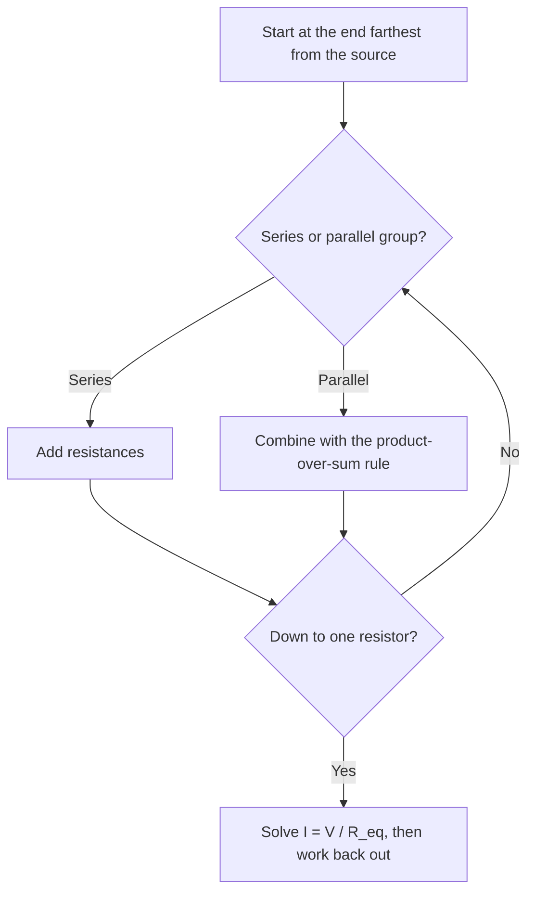

## Overview

How to collapse groups of resistors into one, and the two divider rules that skip most of the algebra.

## Notes

### Combining resistors

- **Series** (same current through each): $R_{eq} = R_1 + R_2 + \dots$
- **Parallel** (same voltage across each): $\dfrac{1}{R_{eq}} = \dfrac{1}{R_1} + \dfrac{1}{R_2} + \dots$

For exactly two in parallel there's a shortcut:

$$
R_1 \parallel R_2 = \frac{R_1 R_2}{R_1 + R_2}
$$

### Voltage divider

![[smp-101-voltage-divider.svg]]

Two resistors in series split the source voltage in proportion to their resistance:

$$
V_{out} = V_s \cdot \frac{R_2}{R_1 + R_2}
$$

### Current divider

Two resistors in parallel split the incoming current, with **more** current through the **smaller** resistor:

$$
I_1 = I_{total} \cdot \frac{R_2}{R_1 + R_2}
$$

### Simplifying a network



### Checking answers with code

```python
def series(*rs):
    return sum(rs)

def parallel(*rs):
    return 1 / sum(1 / r for r in rs)

# 2k in series with (3k || 6k)
print(series(2000, parallel(3000, 6000)))  # 4000.0
```

## Examples

**Voltage divider:** $V_s = 12$ V, $R_1 = 2$ kΩ, $R_2 = 4$ kΩ.

$$
V_{out} = 12 \cdot \frac{4}{2 + 4} = 8\text{ V}
$$

**Current divider:** 6 mA into 3 kΩ ∥ 6 kΩ.

$$
I_{3k} = 6 \cdot \frac{6}{3 + 6} = 4\text{ mA}
\qquad
I_{6k} = 6 \cdot \frac{3}{3 + 6} = 2\text{ mA}
$$

## Common mistakes

- Using the divider formula when a load is attached to $V_{out}$. The load is in parallel with $R_2$, so combine them first.
- In the current divider, putting the resistor's **own** value on top. It's the **other** resistor.
